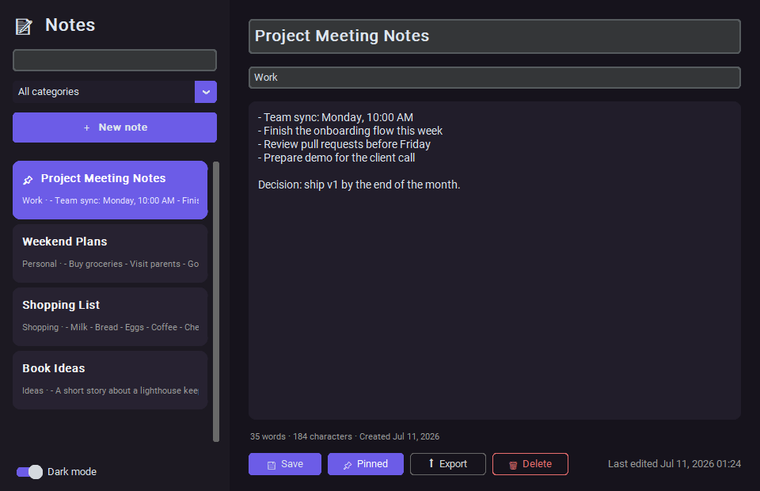

# 📝 Notes

A simple, clean desktop notes app built with Python and
[CustomTkinter](https://github.com/TomSchimansky/CustomTkinter).

Write notes, organize them into categories, pin the important ones, search
through everything, and switch between dark and light themes. Everything is
stored locally in a single JSON file — no accounts, no cloud, no tracking.



## Features

- **Create, edit and delete notes** with a title, category and body.
- **📌 Pin important notes** — pinned notes float to the top of the list.
- **Categories** — group notes and filter the sidebar by category.
- **Live search** — filter notes by title, category or body as you type.
- **Word & character count** plus the note's creation date, shown live in the editor.
- **Export** any note to a `.txt` or `.md` file for sharing or backup.
- **Auto-save** — edits are saved when you switch notes or close the window.
- **Dark / light mode** toggle.
- **Local storage** — notes live in `notes_data.json` next to the app and are
  never committed to git.
- **Keyboard shortcuts** — `Ctrl+S` to save, `Ctrl+N` for a new note.

## Requirements

- Python 3.10 or newer
- [CustomTkinter](https://pypi.org/project/customtkinter/) 5.2+

## Installation

```bash
# (optional) create and activate a virtual environment
python -m venv .venv
.venv\Scripts\activate      # Windows
# source .venv/bin/activate  # macOS / Linux

# install dependencies
pip install -r requirements.txt
```

## Usage

```bash
python main.py
```

Click **＋ New note** to start writing. Use the search box and category
dropdown at the top of the sidebar to find notes. Pin a note with the
**📌 Pin** button to keep it at the top, and use **⬆ Export** to save it as a
file. Your notes are saved automatically, and also on demand with the
**💾 Save** button or `Ctrl+S`.

## Project structure

| File               | Responsibility                                              |
| ------------------ | ----------------------------------------------------------- |
| `main.py`          | Entry point — launches the app.                             |
| `models.py`        | The `Note` data model and (de)serialization.                |
| `storage.py`       | Loading and saving notes to the local JSON file.            |
| `ui.py`            | The CustomTkinter graphical interface.                      |
| `requirements.txt` | Python dependencies.                                        |

The code is split into three layers — data model, storage, and UI — so each
part stays small and easy to read.

## Data & privacy

All notes are stored in `notes_data.json` in the app folder. This file is
listed in `.gitignore`, so your personal notes are never committed to GitHub.
To reset the app, simply delete that file.
